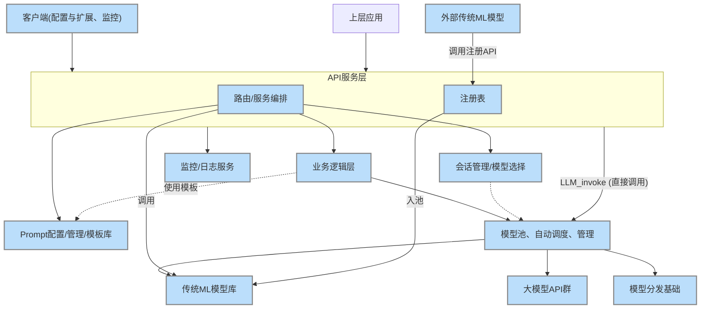
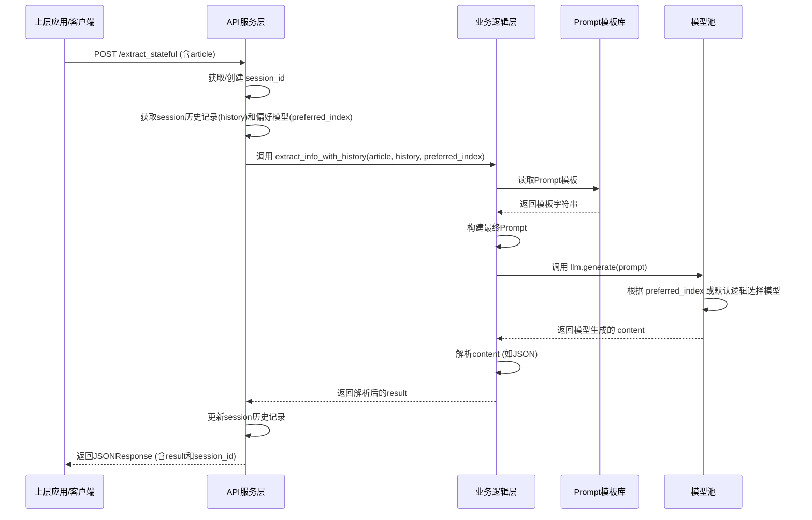
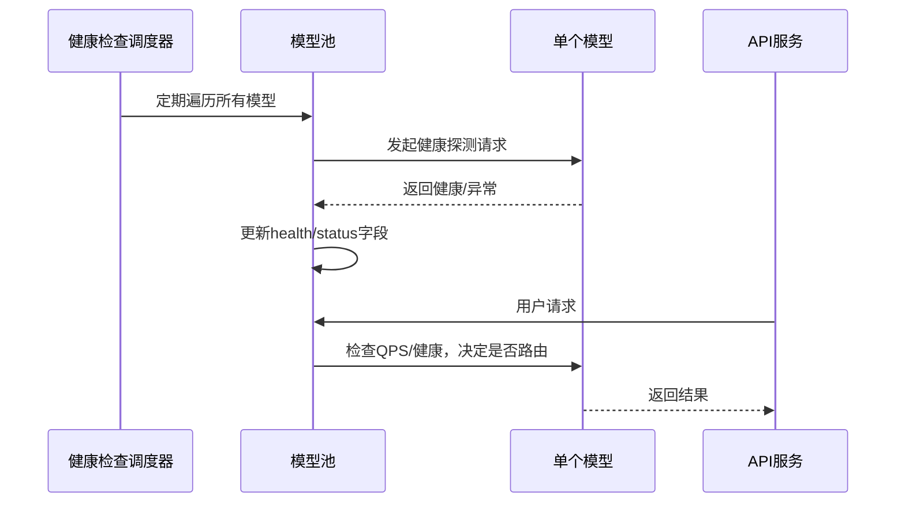
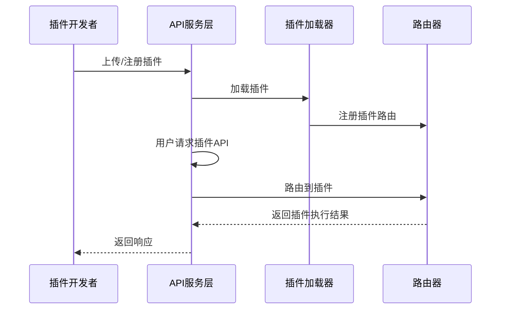
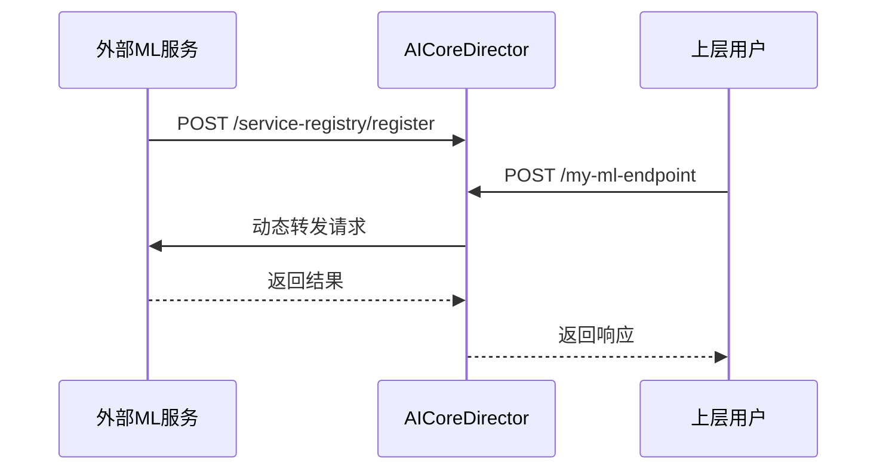
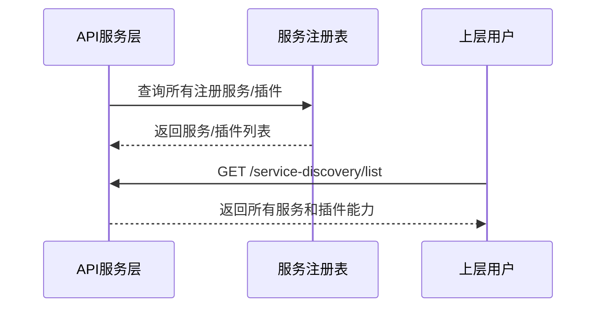

#                               AI基础能力的核心中枢-AICoreDirector


# 1. 项目简介

AICoreDirector是一个统一承载公司所有大模型调用、AI相关能力组件与传统ML模型的服务能力；统一接口、对大模型与AI相关服务的智能路由与调度、Fallback机制及集成、管理。可以作为企业级生产需求成为AI能力的"总线"与"中枢"。

- ## 功能特性与核心能力

  - 多模型统一管理：支持主流大语言模型（LLM）与传统ML模型的注册、切换、动态扩展与持久化，满足异构模型统一治理需求。

  - 智能路由与调度：基于标签、业务等级、健康状态、QPS、成本等多维度，智能选择最优模型，支持主备切换等高级策略。

  - 插件化与热插拔机制：内置插件机制，支持业务插件、模型插件的自动注册与热插拔，便于扩展AI相关服务能力和定制化开发。

  - API服务与易用开发体验：提供丰富的API，支持AI服务、模型调用、模型管理、监控查询等，配套完善文档与开发规范，降低集成门槛。

  - 自动健康检查与弹性上下线：定期检测模型可用性，自动完成上下线与主备切换，保障服务高可用。

  - QPS与命中率监控：实时统计各模型QPS与命中率，支持流量治理与容量规划。

  - 成本与Token消耗统计：自动记录每次调用的Token消耗与成本，支持多维度聚合与分账，助力企业成本可控。

  - 服务注册与心跳机制：支持外部服务注册、健康检查与心跳，便于服务治理与弹性扩展。

    

## 目录结构

项目主要目录和文件说明如下：

| **目录/文件**                  | **作用与规范性说明**                         |
|-------------------------------|---------------------------------------------|
| `adapters/`                   | 适配器层，常见于多模型/多后端项目            |
| `api/`                        | API 服务入口，常见于微服务/平台型项目         |
| `business/`                   | 业务逻辑层，结构清晰                         |
| `config_prompts/`             | 配置分离，便于管理 prompt，合理               |
| `core/`                       | 核心功能模块，常见于中大型项目                |
| `examples/`                   | 示例代码，GitHub 推荐有此目录                 |
| `scripts/`                    | 脚本工具，常见于自动化/运维/数据处理          |
| `tests/`                      | 测试用例，GitHub 强烈推荐有此目录             |
| `README.md`                   | 项目说明，必备                                |
| `pyproject.toml`              | 依赖/构建管理文件                            |
| `openapi.json`                | API 文档，便于对接和测试                      |
| `PLUGIN_DEVELOPMENT_GUIDE.md` | 插件开发文档，便于生态建设                    |
| `AICoreDirector.log`               | 日志文件，建议加入 .gitignore                |
| `uv.lock`                     | 依赖锁文件，若用 uv/poetry/pipenv 可上传      |

## 安装与运行
1）. 克隆项目
   ```bash
   git clone https://github.com/yourname/AICoreDirector.git
   cd AICoreDirector
   ```
2）. 安装依赖
   ```bash
   pip install -r requirements.txt  ### 或使用 poetry/uv
   ```
3）. 配置模型池
   - 编辑 `llm_models.yaml`，根据需要填写模型名称、URL、Key、标签、QPS、成本等信息。
4）. 启动服务
   ```bash
### 开发环境
uvicorn api.main:app --reload

### 生产环境（推荐）
uvicorn api.main:app --host 0.0.0.0 --port 8000 --workers 4 --log-config log_config.json
   ```


## 前端页面与功能说明

| 页面/菜单         | 主要功能与说明                                                                                   | 关联API                          |
|------------------|--------------------------------------------------------------------------------------------------|-----------------------------------|
| 监控仪表盘       | - 展示模型QPS、健康、命中率、成本等全局监控指标                                                   | /get_model_qps, /get_model_health, /get_model_hit_count, /get_model_cost |
|                  | - 实时监控各模型健康状态（healthy/unknown）和可用状态（可用/下线）                                |                                   |
|                  | - 展示各模型累计调用次数、命中率统计、成本统计（总成本、按用户/应用聚合）                        |                                   |
|                  | - 支持自动刷新、趋势图表、告警阈值设置                                                            |                                   |
| LLM配置          | 增删改 LLM（llm_models.yaml），支持模型名、API地址、Key、标签等配置，自动同步后端                   | /manage_LLM, /list_LLM            |
| 插件管理         | 展示和管理所有已注册插件，支持能力发现、参数查看、插件调用                                         | /plugin/list, /service-discovery/list, /plugin/invoke |
| 服务发现         | 展示所有通过服务注册的AI服务和插件能力，便于开发者/运维一览平台能力                                | /service-discovery/list           |
| 调用历史         | 展示模型/插件调用历史记录，便于追溯和分析                                                          | （预留/可扩展）                   |
| Prompt管理       | 管理和配置Prompt模板，支持增删改查、模板分组、内容编辑                                            | /prompt/list, /prompt/update, /prompt/delete, /prompt/add |
| 帮助             | 展示项目文档、API说明、FAQ、使用指南等，支持目录导航和分章节阅读                                    | /readme/sections, /readme/section |

> 各页面均基于 Element Plus + Vue3 实现，支持自动刷新、表格展示、弹窗编辑等现代交互体验。页面与后端API高度解耦，便于二次开发和扩展。

## 贡献指南
1）. Fork 本仓库并新建分支
2）. 提交代码并发起 Pull Request
3）. 遵循项目代码风格和注释规范

## 许可证
本项目采用 MIT License，详见 LICENSE 文件。

---


# 2. 项目意义与作用

AICoreDirector 致力于成为企业级AI能力的"总线"与"中枢"，为各类组织和开发者提供统一、智能、高效的AI能力治理平台。

## 2.1 为什么需要AICoreDirector？

- **统一入口，集中治理**：整合公司所有大模型、AI组件与传统ML服务，屏蔽底层API差异，简化集成流程。
- **加速AI创新**：为各业务线、团队、上层应用提供一致、标准化的API接口，极大降低AI能力集成和创新门槛。
- **灵活可扩展**：支持模型热插拔、插件化扩展、智能路由、主备切换，适应AI技术和业务的快速演进。
- **集中最佳实践**：统一实现提示词工程、输出格式约束、内容审核、日志监控等通用能力，避免重复造轮子。
- **成本与风险可控**：集中管理模型调用、成本核算、预算控制、负载均衡、熔断降级，提升系统健壮性和可运维性。

## 2.2 典型应用场景

AICoreDirector 可广泛应用于以下场景：

- **企业级AI能力中枢**：作为企业内部所有AI/大模型/ML能力的统一入口和治理平台，适用于金融、医疗、制造、零售、互联网等行业。
- **软件公司/ISV的AI能力平台**：为SaaS、PaaS、定制软件公司（ISV）提供AI能力总线，快速集成多家大模型、私有模型、传统ML服务，支持插件化业务扩展和二次开发。
- **多云/混合云AI治理**：支持多云、多供应商、本地+云混合部署，满足合规、成本、弹性等企业需求。
- **AI能力开放平台/生态**：作为AI能力开放平台，对外输出API，支持合作伙伴、开发者生态建设。
- **AI能力中台/数据中台**：作为企业数据中台、AI中台的核心组件，统一管理和调度AI/ML能力。

## 2.3 本章小结

AICoreDirector 不仅解决了企业AI能力集成、治理、运维、创新等核心痛点，还为软件公司和开发者提供了高效、可扩展的AI能力平台。无论是企业内部AI中枢，还是面向外部的AI能力开放平台，AICoreDirector都能提供坚实的技术底座和治理能力。


# 3. 主要功能

**3.1  LLM的自动调度和统一管理**
模型池以及自动调度、并发、管理： 统一实现模型调用、错误处理、重试逻辑，满足异构模型统一治理需求。根据策略（模型能力、成本等匹配）将请求分发到不同的模型实例。

智能路由与调度：基于标签、业务等级、健康状态、QPS、成本等多维度，智能选择最优模型，支持主备切换等高级策略。

自动健康检查与弹性上下线：定期检测模型可用性，自动完成上下线与主备切换，保障服务高可用。

QPS与命中率监控：实时统计各模型QPS与命中率，支持流量治理与容量规划。

成本与Token消耗统计：自动记录每次调用的Token消耗与成本，支持多维度聚合与分账，助力企业成本可控。


**3.2 自身研发的LLM相关的应用模型服务的集成和统一调度**

自身研发的AI应用相关模型主要指内容提取、打标签、生成任务、事件抽取、向量生成、........等公司积累的主要AI小组件 。可以通过插件或远程服务注册机制集成和统一调度。 


**3.3** **传统ML模型服务的集成和统一调度**

集成公司已有的非LLM机器学习模型预测服务（如分类、回归、推荐）。可以通过插件或远程服务注册机制集成和统一调度。 


**3.4** **提示词模板中心、集中最佳实践**
统一实现典型业务类型提示词工程、输出格式约束、内容审核等通用能力，避免重复造轮子。


**3.5** **插件化与服务注册机制**
插件化与热插拔机制：支持模型插件的自动注册与热插拔，便于能力扩展与定制。服务注册与热插拔机制：支持远程模型服务的自动注册与热插拔，便于能力扩展与定制


# 4. 软件架构与模块说明

本章包括架构图、主要模块说明，让读者快速理解整体设计。

## 4.1 总体架构图





## 4.2 主要模块说明

- **API服务层**：对外提供RESTful接口，负责参数校验、路由分发、异常处理
- **业务逻辑层**：实现核心业务流程，如模型选择、会话管理、Prompt处理等
- **模型池（LLM Pool）**：统一管理所有可用大模型及其元数据，支持动态扩展
- **智能路由/调度**：根据业务需求、模型状态等智能选择最优模型
- **健康检查与QPS监控**：定期检测模型健康，实时统计QPS与命中率
- **插件机制**：支持模型、服务的热插拔与动态注册
- **管理与监控端**：支持模型管理、流量监控、健康状态查询等

- **Prompt模板中心**：集中管理所有业务场景下的提示词模板，支持多格式（YAML/JSON/INI）存储、API 动态增删改查、热加载。为 LLM 调用和插件提供标准化 Prompt 支持。

- **服务注册与发现**：支持外部 AI 服务、插件的自动注册、注销和能力发现，便于平台能力扩展和统一治理。

- **会话/状态管理**：管理用户会话、上下文、参数自动传递（如 contextvars），支持多轮对话、批量任务参数隔离等。

- **监控/日志服务**：负责采集和存储系统运行日志、API调用日志、模型调用日志、性能指标（QPS、延迟、错误率等），为运维和故障排查提供数据支撑。支持结构化日志输出和对接外部监控平台。


# 5. 环境准备与快速开始

本章介绍安装依赖、模型配置文件、启动方式，便于新用户上手。

## 5.1 环境依赖

- Python 3.9+
- 推荐使用`venv`或`conda`虚拟环境
- 依赖包见`requirements.txt`，如`fastapi`、`uvicorn`、`openai`、`httpx`、`filelock`等

## 5.2 模型配置文件

- 使用`llm_models.yaml`文件管理模型池配置，支持多模型注册、热加载和动态扩展。

- 示例：

  ```yaml
  models:
    - name: deepseek-r1-think
      url: https://api.huiyan-ai.cn/v1
      key: sk-xxx
      version: v1.0
      meta:
        tags: [openai, gpt4]
        status: 可用
        qps: 2
        cost: 0.002
  ```

- 支持通过前端页面或API动态注册/更新/删除模型，自动同步到`llm_models.yaml`。

## 5.3 启动服务

```bash
pip install -r requirements.txt

### 开发环境
uvicorn api.main:app --reload

### 生产环境（推荐）
uvicorn api.main:app --host 0.0.0.0 --port 8000 --workers 4 --log-config log_config.json
```

## 5.4 日志系统

项目使用结构化日志系统，支持 JSON 格式输出，便于日志收集和分析。

### 日志配置
- **配置文件**：`log_config.json`（项目根目录）
- **日志文件**：`AICoreDirector.log`（项目根目录）
- **日志级别**：INFO（生产环境推荐）
- **输出格式**：JSON 结构化格式

### 日志内容
- 服务启动/停止信息
- API 请求处理日志
- LLM 模型调用和路由选择
- 插件执行日志
- 错误和异常信息
- 性能监控数据

### 生产环境建议
- 使用 `--log-config log_config.json` 参数启动服务
- 定期轮转日志文件（可使用 logrotate）
- 将日志文件加入 `.gitignore`
- 配置日志监控和告警


# 6. API 说明与接口示例

## 6.1 API 说明

- `/llm_invoke`：LLM 推理接口（支持stream参数流式返回）

- /plugin/invoke:  对插件形式存在的服务，通过 /plugin/invoke?plugin_name=xxx 这样的专用接口调用

- /服务名:  对注册的外部服务的调用，通过 /服务名（如 /generateKG）直接调用，AICoreDirector 动态路由自动转发

- `/set_preferred_model`：设置首选模型

- `/manage_LLM`：模型管理（增删改，支持 LLM/传统ML，自动同步llm_models.yaml和内存模型池）

- `/list_LLM`：列出所有 LLM（仅 llm_models.yaml里的大模型），返回详细元数据，支持前端自动补全

- `/service-discovery/list`：服务发现与能力发现接口，返回所有注册AI服务和插件能力，支持前端服务发现页面自动补全

- `/plugin/list`：插件管理接口，返回所有已注册插件及其元数据，支持前端插件管理页面自动补全

- `/get_model_health`：获取模型健康状态

- `/get_model_qps`：获取模型 QPS

- `/get_model_hit_count`：获取模型命中统计

- `/get_model_cost`：获取模型消耗统计

- `/service-registry/register`：服务注册

- `/service-registry/unregister`：服务注销

  

## 6.2 主要接口参数与返回示例

#### `/llm_invoke`

- **方法**：POST

- **说明**：LLM 推理接口（支持stream参数流式返回）

- **参数**：

  - prompt：输入文本
  - model_name：指定模型（可选）
  - tags、biz_level、prefer_cost、user_id、app_id、temperature、top_p、max_tokens、stop：同上
  - stream（可选，bool）：是否流式返回，默认false。为true时返回StreamingResponse，否则为普通JSON。

- **返回**：

  - 普通JSON：`{"result": ...}`
  - StreamingResponse：返回StreamingResponse对象

- **用法示例**：

  - 普通调用：

    ```python
    requests.post('/llm_invoke', json={"prompt": "你好"})
    ```

  - 流式调用：

    ```python
    requests.post('/llm_invoke?stream=true', json={"prompt": "你好"}, stream=True)
    for chunk in response.iter_content():
        print(chunk.decode(), end='')
    ```

- **上层用户流式消费示例（fetch+ReadableStream）**：

  ```js
  const response = await fetch('/api/llm_invoke?stream=true', {
    method: 'POST',
    headers: { 'Content-Type': 'application/json' },
    body: JSON.stringify({ prompt: '你好' })
  });
  const reader = response.body.getReader();
  const decoder = new TextDecoder();
  let result = '';
  while (true) {
    const { done, value } = await reader.read();
    if (done) break;
    const chunk = decoder.decode(value);
    result += chunk;
    // 实时渲染 chunk 或 result
    console.log(chunk);
  }
  // 最终完整内容在 result
  ```

#### `/list_LLM`  

- **方法**：POST
- **说明**：列出所有已注册 LLM（仅 llm_models.yaml 里的大模型），返回详细元数据，支持前端 LLM 列表页面自动补全。
- **请求参数**：无（如需筛选可扩展 tags、status、name 等参数）
- **返回字段**：
  - `available_llms`：LLM模型列表，每项含 index、name、tags、version、status、cost、qps、health 等
  - `current_global_model_index`：当前全局默认模型索引
  - `current_global_model_name`：当前全局默认模型名
- **返回示例**：

```json
{
  "available_llms": [
    {
      "index": 0,
      "name": "gpt-4",
      "tags": ["llm", "openai"],
      "version": "4.0",
      "status": "可用",
      "cost": 0.01,
      "qps": 10,
      "health": "healthy"
    }
  ],
  "current_global_model_index": 0,
  "current_global_model_name": "gpt-4"
}
```

- **边界情况**：
  - 若 llm_models.yaml 未配置任何 LLM，`available_llms` 为空数组。
  - 若 LLM 配置异常，返回 500 并附带错误信息。
- **错误返回示例**：

```json
{
  "error": "No model info found in llm_models.yaml"
}
```

- **典型用法**：
  - 前端 LLM 配置页、模型列表页自动补全
  - 后台管理/监控页面展示所有 LLM 状态

#### `/service-discovery/list`  

- **方法**：GET
- **说明**：返回所有通过服务注册的AI服务（endpoint、target_url、health_check、last_updated等元数据），以及所有插件API（能力发现，含参数、模块、说明等元数据），支持前端服务发现页面自动补全。
- **请求参数**：无
- **返回字段**：
  - `registered_services`：注册服务列表，每项含 endpoint、target_url、health_check、last_updated
  - `plugin_abilities`：插件能力列表，每项含 name、module、params、doc
- **返回示例**：

```json
{
  "registered_services": [
    {"endpoint": "my-ml-service", "target_url": "http://localhost:9000/predict", "health_check": "/health", "last_updated": "2024-05-01T12:00:00"}
  ],
  "plugin_abilities": [
    {"name": "hello_plugin", "module": "business.hello_plugin", "params": ["text"], "doc": "示例插件"}
  ]
}
```

- **边界情况**：
  - 若无注册服务，`registered_services` 为空数组。
  - 若无插件能力，`plugin_abilities` 为空数组。
- **错误返回示例**：

```json
{
  "registered_services": [],
  "plugin_abilities": []
}
```

- **典型用法**：
  - 前端"服务发现"页面自动展示所有注册AI服务和插件能力
  - 运维/开发者可据此了解当前平台可用AI能力和服务健康状况

#### `/plugin/list`  

- **方法**：GET
- **说明**：返回所有已注册插件的名称、描述、参数等元数据，便于前端插件管理页面自动补全。
- **返回示例**：

```json
{
  "plugins": [
    {"name": "hello_plugin", "description": "示例插件", "params": ["text"]},
    {"name": "doc_extractor", "description": "文档抽取插件", "params": ["article"]}
  ]
}
```

#### 提示词模板中心相关API

##### `/api/prompts/list`

- **方法**：GET
- **说明**：列出所有提示词模板文件（支持 YAML/JSON/INI 格式）。
- **返回示例**：

```json
{
  "files": [
    "prompt_x.ini",
    "prompt.yaml"
  ]
}
```

##### `/api/prompts/file`

- **方法**：GET
- **参数**：
  - `name`：模板文件名（如 `prompt_x.yaml`）
- **说明**：获取指定模板文件的全部内容。
- **返回示例**：

```json
{
  "name": "prompt_x.yaml",
  "content": "system: 你是一个AI助手\nuser: 你好"
}
```

##### `/api/prompts/file`

- **方法**：POST
- **参数**：
  - `name`：模板文件名（如 `prompt_x.yaml`）
  - `content`：模板内容（字符串）
- **说明**：保存（覆盖）指定模板文件内容。
- **返回示例**：

```json
{
  "status": "success",
  "name": "prompt_x.yaml"
}
```

##### `/api/prompts/new`

- **方法**：POST
- **参数**：
  - `name`：模板文件名（如 `prompt_new.yaml`）
  - `content`：模板内容（字符串）
- **说明**：新建模板文件（若已存在则报错）。
- **返回示例**：

```json
{
  "status": "created",
  "name": "prompt_new.yaml"
}
```

- **错误返回**：

```json
{
  "error": "File already exists"
}
```

#### `/manage_LLM`  

- **方法**：POST
- **说明**：增删改 LLM/传统ML 模型，自动同步 llm_models.yaml 和内存模型池，支持前端 LLM 配置页面自动补全。
- **参数**：

```json
{
  "action": "add|update|delete",
  "model_name": "gpt-4",
  "base_url": "https://api.openai.com/v1",
  "api_key": "sk-xxxx",
  "tags": ["llm", "openai"],
  "version": "4.0",
  "status": "可用",
  "cost": 0.01,
  "qps": 10,
  "health": "healthy"
}
```

- **返回**：操作结果、错误信息等

#### `/list_LLM`  

- **方法**：POST
- **说明**：列出所有已注册 LLM（仅 llm_models.yaml 里的大模型），返回详细元数据，支持前端 LLM 列表页面自动补全。
- **返回示例**：

```json
{
  "available_llms": [
    {
      "index": 0,
      "name": "gpt-4",
      "tags": ["llm", "openai"],
      "version": "4.0",
      "status": "可用",
      "cost": 0.01,
      "qps": 10,
      "health": "healthy"
    },
    {
      "index": 1,
      "name": "glm-4-flash",
      "tags": ["llm", "glm"],
      "version": "1.0",
      "status": "可用",
      "cost": 0.001,
      "qps": 100,
      "health": "healthy"
    }
  ],
  "current_global_model_index": 0,
  "current_global_model_name": "gpt-4"
}
```

详细参数和返回格式请参考 [openapi.json](openapi.json) 或启动服务后访问 `/docs`。

#### 健康状态

- `GET /get_model_health`
- 说明：返回所有模型的健康状况（如 healthy/unknown）和可用状态（如 可用/下线），便于监控和路由。
- 参数：无
- 返回示例：

```json
{
  "gpt-4": {"health": "healthy", "status": "可用"},
  "my-ml-model": {"health": "unknown", "status": "下线"}
}
```

#### 命中率统计

- `GET /get_model_hit_count`
- 说明：返回所有模型被选中的累计次数，用于流量分析、A/B测试等。
- 参数：无
- 返回示例：

```json
{
  "gpt-4": 1234,
  "my-ml-model": 56
}
```

#### 成本统计

- `GET /get_model_cost`
- 说明：返回各模型累计消耗的成本（如元），便于成本分析和预算管理。
- 参数：无
- 返回示例：

```json
{
  "gpt-4": 12.34,
  "my-ml-model": 0.56
}
```

- `GET /get_model_cost_user_app`
- 说明：支持按 user_id、app_id 聚合查询各模型的累计成本，便于多租户、分账、预算管理。
- 参数：
  - `user_id`（可选）：用户ID
  - `app_id`（可选）：应用ID
- 返回示例：

```json
{
  "('gpt-4', 'user1', 'appA')": 5.12,
  "('gpt-4', 'user2', 'appA')": 2.34,
  "('my-ml-model', 'user1', 'appB')": 0.12
}
```


# 7. 智能路由与调度策略

AICoreDirector的智能路由与调度策略实现了 LLM 调用、插件调用、注册ML服务调用的统一治理、分流、监控和弹性扩容，是企业级AI平台的最佳实践。
- 所有AI能力（LLM、插件、外部ML服务）都通过统一API和调度层治理，实现了分层解耦、集中治理、弹性扩展、健康监控、参数透传、业务无感知。
- 支持多种分流参数和优先级，灵活适配各种业务场景。
- 插件机制让业务能力可插拔、可编排、可扩展。
- 外部服务注册与动态路由让传统ML/微服务能力无缝集成到AI中枢。

##7.1. LLM调用的智能路由与调度

入口：
- 主要通过 `/llm_invoke` API。
- 也可通过插件（如 `/plugin/invoke`）间接调用 LLM。

##7.2. 插件调用的智能路由与调度

入口：
通过 `/plugin/invoke?plugin_name=xxx` 统一调用所有注册插件（包括 LLM 驱动的业务插件、信息抽取、定制流程等）。

路由与调度逻辑：
- 插件本身可调用 LLM、外部ML服务、PromptManager 等，作为业务编排层。
- 插件API参数自动采集 contextvars，支持 LLM 路由参数的透传。
- 批量/并发调度：`batch_concurrent` 机制为每个任务单独 set contextvars，确保每条请求都能感知到正确的路由参数。
- 插件本身的分流：如插件内部调用 LLM，则走 LLM 的智能分流逻辑；如调用外部ML服务，则走外部服务的路由逻辑。

##7.3. 注册的ML服务的智能路由与调度

注册机制：
- 外部ML服务通过 `/service-registry/register` 注册，平台记录 endpoint、target_url、health_check 等信息。

路由与调度逻辑：
- 动态路由：`api/main.py` 的 `@app.api_route("/{path:path}")` 动态路由会自动检测请求路径是否为已注册的 endpoint。
- 自动代理：如匹配到已注册服务，平台自动将请求代理到对应的 target_url，支持所有 HTTP 方法。
- 健康检查：平台定期对已注册服务做健康检查，服务发现接口 `/service-discovery/list` 可查询所有注册服务的状态。
- 弹性扩容/治理：可结合 Nacos/服务网格等基础设施实现更高级的弹性治理。


# 8. LLM池与元数据管理

本章详细说明如何注册LLM和传统ML模型，元数据字段说明。

## 8.1 支持的元数据字段

- `name`：模型名称
- `url`：API地址
- `key`：API密钥（如有）
- `tags`：能力标签（如"多语言""低成本"）
- `version`：模型版本
- `status`：可用/下线
- `cost`：单位成本
- `qps`：最大QPS
- `health`：健康状况（healthy/unhealthy）

## 8.2 添加/更新/删除LLM

- 推荐通过前端"LLM配置"页面或`/manage_LLM`接口进行
- 支持批量添加、动态扩展、热加载，所有变更自动同步到`llm_models.yaml`

## 8.3 LLM池结构

- 内存中为`List[Dict]`结构，支持高效查找与动态扩展
- 支持线程安全、并发访问

## 8.4 常用数据型元数据及推荐默认值

| 字段名               | 类型    | 推荐默认值 | 说明                         |
|----------------------|---------|------------|------------------------------|
| qps                  | int     | 2          | 最大QPS，默认2便于测试       |
| cost                 | float   | 0.0        | 单次调用成本，默认0          |
| latency              | int     | 1000       | 平均延迟ms，默认1000         |
| error_rate           | float   | 0.0        | 错误率，默认0                |
| max_input_length     | int     | 2048       | 最大输入长度，默认2048       |
| effect_score         | float   | 5.0        | 效果评分1-10，默认5          |
| current_concurrency  | int     | 0          | 当前并发数，默认0            |
| health               | str/int | "unknown" | 健康状态，默认unknown        |


# 9. LLM智能负载均衡与自适应路由

AICoreDirector 支持多 LLM/模型服务的智能分流，自动感知各模型的并发极限、健康状态、响应延迟、错误率、成本等多项指标，实现高效的负载均衡。

---

### 设计目标

- **动态感知**：实时监控每个 LLM 的健康、并发、速率、延迟、错误率、成本等状态，避免单点瓶颈。
- **高吞吐量**：批量/高并发任务自动分流到多 LLM，提升整体吞吐量。
- **自动分流**：单 LLM 达到极限时自动切换，避免排队或限流。
- **多云与混合部署**：支持多云、多供应商、本地+云混合部署，提升系统弹性。
- **一键开关**：支持分流策略一键开关，便于测试和维护。

---

### LLM 路由与负载均衡逻辑

AICoreDirector 的 LLM 路由与分流分为两步：**参数决策入口（路由优先级）** 和 **候选池内负载均衡（评分机制）**。

---

#### 1. 路由优先级（参数决策入口）

系统会根据以下优先级，逐步筛选候选模型池：

1. **model_name**：如明确指定，强制使用该模型。
2. **session/session_id/preferred_index**：如有绑定，优先使用该模型（如会话级优选）。
3. **biz_level**：如指定，优先筛选满足业务等级（如 premium/standard/economy）的模型。
4. **prefer_cost**：如指定，优先筛选/排序低成本或高成本模型。
5. **tags**：如指定，优先筛选具备这些标签能力的模型。
6. **都未指定**：则进入下一步，仅按健康/延迟/错误率/并发等综合排序。

> **自动 fallback**：如首选模型不可用，自动切换到下一个健康 LLM。

**决策流程举例：**
- 只给 model_name：只用该模型。
- 只给 biz_level：优先选业务等级对应的模型，再按成本/健康等排序。
- 只给 prefer_cost：优先选低/高成本模型，再按健康等排序。
- 全给：按上述优先级依次筛选。
- 都不给：只按健康/延迟/错误率/并发等综合排序。

**示例参数：**
- `model_name`: "GLM-4-Flash"
- `session_id`: "xxxx"
- `preferred_index`: 1
- `biz_level`: "premium"/"economy"/"normal"
- `prefer_cost`: "low"/"high"
- `tags`: ["api"]

**示例调用：**
```python
### 只指定低成本
resp = requests.post(..., json={"batch_payload": batch_payload, "prefer_cost": "low"})
### 指定业务等级
resp = requests.post(..., json={"batch_payload": batch_payload, "biz_level": "premium"})
### 同时指定
resp = requests.post(..., json={"batch_payload": batch_payload, "biz_level": "premium", "prefer_cost": "low"})
### 强制指定模型
resp = requests.post(..., json={"batch_payload": batch_payload, "model_name": "GLM-4-Flash"})
```
平台会自动根据上述优先级决策，无需业务方关心底层分流细节。

---

#### 2. 候选池内负载均衡与评分机制

在经过参数优先级筛选后，系统会对候选模型池进行进一步的负载均衡和排序，具体逻辑如下：

- **健康优先**：只选择健康且可用的模型，过滤掉不健康或下线的模型。
- **未超载优先**：优先选择当前并发数小于最大并发上限（`max_concurrency`/`qps`，默认2）的模型。
- **标签/能力筛选**：如有 `tags` 参数，进一步筛选具备指定能力的模型。
- **业务等级优先**：
  - 高价值业务（`biz_level == 'premium'`）：优先高成本、QPS 高的模型。
  - 经济型业务（`biz_level == 'economy'`）：优先低成本模型。
  - 普通业务（`biz_level == 'normal'`）：优先性价比高的模型。
- **成本偏好**：如 `prefer_cost == 'low'`，按成本升序排序；如 `prefer_cost == 'high'`，按成本降序排序。
- **综合评分排序**：在健康且未超载的模型中，按如下分数排序，选择分数最低者：
  - 错误率（权重最高）
  - 延迟
  - 单位成本
  - 当前并发数
- **兜底策略**：如无合适模型，抛出异常报错；若所有模型都超载，则退而选健康模型，再不行则兜底选全部模型。
- **并发上限说明**：只影响同一时刻最大请求数，不影响分流顺序或调用次数分配。
- **非轮询说明**：当前分流逻辑**不是严格的轮询**，也不是"每模型连续调用N次再切换"。
- **参数说明**：
  - `max_concurrency`/`qps`：控制单模型最大并发数，默认2。
    测试环境：2~3（如本项目默认值）
  生产环境：根据实际压测结果，通常5~20
    高负载场景：20~50+
    关键业务：建议保守设置，避免过载
  - 其它分流参数可在 `adapters/llm_adapter.py` 中调整。
  
  

​    **多因素分流策略伪代码**

```python
class LLMManager:
    def __init__(self, llms):
        self.llms = llms  # [{name, max_concurrency, current_concurrency, healthy, latency, error_rate, cost, ...}]
    def select_llm(self):
        candidates = [llm for llm in self.llms if llm['healthy'] and llm['current_concurrency'] < llm['max_concurrency']]
        if not candidates:
            candidates = [llm for llm in self.llms if llm['healthy']]
        if not candidates:
            candidates = self.llms
        def score(llm):
            # 权重可调整：错误率>延迟>成本>并发
            return (
                llm['error_rate'] * 1000 +
                llm['latency'] * 0.1 +
                llm['cost'] * 10 +
                llm['current_concurrency'] * 5
            )
        return min(candidates, key=score)
```

------

#### 关键机制

- **健康监控**：定期采集 LLM 可用性、响应时间、错误率。
- **并发/速率感知**：实时统计每个 LLM 的当前并发数和最大并发上限。
- **延迟与错误率统计**：每次调用后动态更新 LLM 的滑动平均延迟和近窗口错误率。
- **动态分流调度**：优先分配给健康、负载低、响应快、错误率低、成本低的 LLM，支持多因素加权排序。
- **熔断与恢复**：LLM 超载或异常时自动下线，恢复后自动纳入分流池。

---


# 10. 提示词模板中心

AICoreDirector 内置"提示词模板中心"，用于集中管理和复用各类 Prompt（提示词）模板，支持多业务场景下的高效提示词工程和最佳实践沉淀。

## 10.1 主要功能

- **多格式支持**：支持 YAML、JSON、INI 等多种格式的提示词模板，便于结构化管理和团队协作。
- **模板分组与命名**：每个模板文件可按业务、插件、场景等分组命名，支持多模板并存。
- **模板增删改查**：提供完善的 API 和前端页面，支持模板的创建、编辑、保存、删除和内容预览。
- **热加载与即时生效**：模板变更后可即时生效，无需重启服务。
- **灵活调用**：业务插件、API 层可按需加载和调用指定模板，支持多场景复用和参数化。

## 10.2 管理与使用方式

### 10.2.1 模板文件存储

- 所有模板文件统一存放于 `config_prompts/` 目录下，支持 `.yaml`、`.json`、`.ini` 等格式。
- 文件名建议以业务/插件/场景命名，如 `prompt_x.ini`、`prompt.yaml` 等。

### 10.2.2 API 接口

#### `/api/prompts/list`

- **方法**：GET
- **说明**：列出所有提示词模板文件（支持 YAML/JSON/INI 格式）。
- **返回示例**：

```json
{
  "files": [
    "prompt_x.ini",
    "prompt.yaml"
  ]
}
```

#### `/api/prompts/file`

- **方法**：GET
- **参数**：
  - `name`：模板文件名（如 `prompt_x.yaml`）
- **说明**：获取指定模板文件的全部内容。
- **返回示例**：

```json
{
  "name": "prompt_x.yaml",
  "content": "system: 你是一个AI助手\nuser: 你好"
}
```

#### `/api/prompts/file`

- **方法**：POST
- **参数**：
  - `name`：模板文件名（如 `prompt_x.yaml`）
  - `content`：模板内容（字符串）
- **说明**：保存（覆盖）指定模板文件内容。
- **返回示例**：

```json
{
  "status": "success",
  "name": "prompt_x.yaml"
}
```

#### `/api/prompts/new`

- **方法**：POST
- **参数**：
  - `name`：模板文件名（如 `prompt_new.yaml`）
  - `content`：模板内容（字符串）
- **说明**：新建模板文件（若已存在则报错）。
- **返回示例**：

```json
{
  "status": "created",
  "name": "prompt_new.yaml"
}
```

- **错误返回**：

```json
{
  "error": "File already exists"
}
```

### 10.2.3 代码调用

- 通过 `PromptManager` 类统一加载和管理所有模板，支持按插件名、模板名获取内容。

- 典型用法：

  ```python
  from core.prompt_manager import PromptManager
  pm = PromptManager()
  prompt = pm.get_prompt('prompt_x', 'default')  # 获取 prompt_x.yaml 中 default 模板
  ```

### 10.2.4 前端页面

- 前端提供"Prompt管理"页面，支持模板的增删改查、内容编辑、分组展示等操作，便于团队协作和最佳实践沉淀。

### 10.2.5 业务集成

- 插件、API、业务逻辑可通过统一接口动态加载和应用模板，实现提示词工程的集中管理和灵活复用。
- 支持参数化模板、分场景调用、版本管理等扩展。

## 10.3 典型场景举例

- **文档抽取/摘要**：不同业务线可维护各自的抽取/摘要模板，按需切换。
- **多语言支持**：同一业务可维护多语言模板，按用户语言动态加载。
- **A/B 测试**：支持快速切换不同提示词模板，便于效果对比和优化。

# 

# 11. 外部传统ML模型服务的注册与调用

AICoreDirector 支持通过服务注册机制集成外部传统ML模型服务，实现统一入口、统一治理。

## 1）. 注册外部传统ML模型服务

- 外部ML服务通过 `/service-registry/register` 接口注册到AICoreDirector。
- 注册时需提供 `endpoint`（服务名）、`target_url`（服务地址）、`health_check`（健康检查路径，可选）等信息。
- 服务方还必须要实现并暴露health_check接口，如下例子中/health接口。AICoreDirector会存储并用于主动健康探测。

**注册示例：**

```python
示例1：

import requests
service_data = {
    "endpoint": "my-ml-endpoint",
    "target_url": "http://localhost:9000/predict",
    "health_check": "/health"
}
resp = requests.post('http://localhost:8000/service-registry/register', json=service_data)
print(resp.json())


示例2：

import requests
@app.get("/health")
def health():
    return {"status": "ok"}

@app.post("/generateKG")
async def generateKG(data_model: DataModel):
    data = data_model.data
    try:
        await rag.insert(data)
    except Exception as e:
        return {"result": "error", "detail": str(e)}

    return {"result": "success"}

### 在您的Python服务中添加注册功能
def register_with_llm_gateway():
    registration_data = {
        "service_name": "knowledge_graph_generator",
        "endpoint": "generateKG",  ### 您要暴露的端点
        "target_url": "http://localhost:8080",  ### 您的服务实际地址
        "health_check": "/health",  ### 健康检查端点
        "description": "知识图谱生成服务",
        "auth_token": "YOUR_SECRET_TOKEN"  ### 用于验证
    }

    ### 向LLM服务层的注册端点发送注册请求
    response = requests.post(
        "http://127.0.0.1:8000/service-registry/register",
        json=registration_data
    )

    if response.status_code == 200:
        print("服务注册成功！!!")
    else:
        print(f"注册失败: {response.text}")
```

## 2）. 上层用户调用注册的传统ML模型

- 上层用户通过AICoreDirector的统一入口，直接请求 `/my-ml-endpoint`（或注册时指定的endpoint路径）。
- AICoreDirector的 `dynamic_router` 会自动将请求转发到注册的外部ML服务。

**调用示例：**

```python
示例1：

import requests
resp = requests.post('http://localhost:8000/my-ml-endpoint', json={"text": "输入文本"})
print(resp.json())


示例1：

documents = [document1, document2]
response = requests.post(
     'http://localhost:8080/generateKG',
     json={"data": documents}
)
```

- 支持GET/POST等多种HTTP方法，参数和响应格式与外部ML服务保持一致。
- 这样可实现所有AI能力的统一入口、统一监控和统一治理。


# 12. 插件动态批量并发调用接口说明

## `/plugin/invoke` 统一插件调用接口

- **方法**：POST
- **说明**：支持所有动态注册插件的单条/批量调用，自动适配插件参数和批量能力，API 层统一调度并发。
- **开关**：通过 `PLUGINS_BATCH_DISPATCH_ENABLED` 控制，设为 `False` 可一键禁用该逻辑。

### 参数

- `plugin_name`：插件名称（必填，字符串）
- `payload`：单条调用参数（dict，结构随插件定义）
- `batch_payload`：批量调用参数（list[dict]，每个dict结构随插件定义）

### 返回

- 单条调用：`{"result": ...}`
- 批量调用：
  - 若插件本身支持批量参数（如 `articles`/`docs`/`inputs`），整体透传，返回 `{"result": ...}`
  - 若插件只支持单条，API 层自动并发，返回 `{"results": [...]}`

### 典型用法

- **单条**：

  ```json
  {
    "plugin_name": "qa_plugin",
    "payload": {"question": "中国的首都是哪个城市？"}
  }
  ```

- **批量**：

  ```json
  {
    "plugin_name": "extract_",
    "batch_payload": [
      {"article": "文本1"},
      {"article": "文本2"}
    ]
  }
  ```

- **插件本身支持批量**：

  ```json
  import requests
  
  articles_ = [
      {"content": "6月28日，国有企业A发布公告称，完成对B公司的重组，成为其控股股东。此次重组涉及资金10亿元。业内专家李明认为，此次重组有助于提升企业核心竞争力，推动国有企业改革。B公司主要从事新能源和高端装备制造业务。", "title": "标题1", "author": "张三"},
      {"content": "B公司近日又获得一项新能源领域的重大技术突破，预计将进一步提升其市场份额。", "title": "标题2", "author": "李四"},
      {"content": "专家李明表示，未来国有企业在数字经济领域也将有更大作为。", "title": "标题3", "author": "王五"}
  ]
  
  batch_payload = [{"article": doc["content"]} for doc in articles_]
  
  PLUGIN_INVOKE_URL = "http://127.0.0.1:8000/plugin/invoke"
  plugin_name = "extract_"
  
  resp = requests.post(
      f"{PLUGIN_INVOKE_URL}?plugin_name={plugin_name}",
      json={
          "batch_payload": batch_payload,
          "biz_level": "premium",        ### 统一指定业务等级
          "tags": ["api"]               ### 统一指定标签
      }
  )
  data = resp.json()
  
  if "results" in data:
      print("批量返回结果：")
      for idx, res in enumerate(data["results"]):
          print(f"第{idx+1}个文档结果：", res)
  else:
      print("API返回异常：", data)
  print("--- 多文档批量调用结束 ---") 
  ```

  插件签名如 `def extract_(articles: list[str]) -> ...`

### 兼容性与扩展性

- 支持插件参数多样化（如 question、article、text、image 等），API 层自动解包/分发。
- 支持插件本身批量处理能力，API 层智能判断并整体透传，避免重复并发。
- 支持插件只实现单条处理时，API 层自动并发调度。
- 支持一键关闭该功能，便于回退或调试。

### 注意事项

- 插件参数需与 payload/batch_payload key 对应。
- 建议插件开发时在文档或元数据中声明参数规范和是否支持批量。
- 若插件参数不匹配或未找到插件，API 返回 400/404 错误。


# 13. 插件开发者规范

本章为插件开发、注册、调用LLM/ML、最佳实践提供详细说明。

## 13.1 插件与传统ML模型的层级关系

- 插件和传统ML模型在AICoreDirector中属于同一业务扩展层，均可通过统一API注册和调用。
- 插件机制适合Python函数级扩展，传统ML模型适合服务级（RESTful/HTTP）扩展。
- 两者都支持自动注册、能力发现、统一调度和监控。

- 也可通过插件机制封装传统ML模型的调用逻辑，实现更灵活的业务扩展。

## 13.2 插件函数必须用 `@plugin_api` 装饰器

- 只有加了 `@plugin_api` 的函数才会被自动注册为API接口并对外暴露。
- 未加装饰器的函数不会被注册为API，可以作为内部工具函数自由使用。

**示例：**
```python
from plugin_loader import plugin_api

@plugin_api
def hello(name: str):
    return {"msg": f"Hello, {name}!"}

def helper_func(x):
    # 仅供本文件内部调用
    return x * 2
```

## 13.3 插件文件放在 `business/` 目录下

- 每个业务功能建议单独一个 `.py` 文件，便于维护和扩展。
- 文件名、函数名请避免与已有API冲突。

## 13.4 支持自动参数注入

- 插件函数可以声明如下参数，系统会自动注入：
  - `session_id`：当前请求的会话ID（从Cookie自动获取）
  - `state_manager`：全局会话状态管理对象
- 其他参数（如 `name`）会自动从请求的 query/body 里获取。

**示例：**
```python
@plugin_api
def user_info(name: str, session_id: str = None, state_manager=None):
    history = state_manager.get_history(session_id) if session_id and state_manager else []
    return {"name": name, "history_length": len(history)}
```

## 13.5 路由自动注册，无需手动配置

- 每个加了 `@plugin_api` 的函数会自动注册为一级路由（如 `/hello`），支持 GET/POST。
- 也可通过 `/plugin/hello` 兼容路由访问。

## 13.6 不要在插件函数中做全局变量操作

- 会话相关数据请通过 `state_manager` 操作，避免线程安全和多用户数据混淆问题。

## 13.7 错误处理

- 插件函数抛出的异常会被API层捕获并返回标准错误响应，无需手动try/except（除非有特殊业务需求）。

## 13.8 依赖与导入

- 需要用到 `@plugin_api` 装饰器时，`from plugin_loader import plugin_api`。
- 需要用到会话管理时，直接声明 `state_manager` 参数即可，无需手动导入。

## 13.9 推荐开发流程

1. 在 `business/` 目录下新建插件文件（如 `my_plugin.py`）。
2. 在文件中实现业务函数，并加上 `@plugin_api` 装饰器。
3. 如需会话信息，声明 `session_id`、`state_manager` 参数。
4. 启动服务后，自动注册为 `/函数名` 路由。
5. 通过 GET/POST 请求测试接口。

## 13.10 插件API开发注意事项

### 1 ）路由注册与参数类型注解

- 插件API的 endpoint 由系统自动生成，**必须保证 endpoint 的 request 参数有类型注解**，即 `request: Request`，否则 FastAPI 会把它当作 query 参数，导致 422 错误。
- 插件函数本身**不要声明名为 `request` 的参数**，否则会被误认为是必填 query 参数。

**示例（正确）：**
```python
### 插件函数
@plugin_api
def hello(name: str = "World", session_id: str = None, state_manager=None):
    ...

#### endpoint 自动生成时，必须是
async def endpoint(request: Request):
    ...
```

**示例（错误，易导致422）：**
```python
@plugin_api
def hello(name: str, request):  # 错误！不要用 request 作为参数名
    ...
```

### 2） 路由优先级与热加载

- 插件API路由会自动优先注册，兜底 dynamic_router 路由始终在最后，确保插件API优先被匹配。
- 插件热加载时，系统会自动调整路由顺序，无需手动干预。

### 3） 遇到 422 错误的排查建议

- 检查插件函数参数名，确保没有 `request`。
- 检查 endpoint 签名，确保 `request: Request` 有类型注解。
- 如有疑问，查看 `/openapi.json`，确认参数定义是否正确。

### 4） 插件如何调用 LLM 适配器和 Prompt 模板库

#### （1) 调用 LLM 适配器（MultiLLM）
- 推荐通过 `from adapters.llm_adapter import MultiLLM` 获取多模型统一接口。
- 项目已全局初始化了 `llm = MultiLLM()`，插件可直接 `from business.doc_extractor import llm` 复用。
- 支持同步/异步生成、模型切换、异常降级等。

**示例：**
```python
from business.doc_extractor import llm

def my_plugin_func(article: str):
    prompt = f"请分析：{article}"
    result = llm.generate(prompt)
    return {"result": result}
```

#### （2) 调用 Prompt 模板库（PromptManager）
- 推荐通过 `from core.prompt_manager import PromptManager` 加载和获取 prompt 模板。
- 模板文件统一放在 `config_prompts/` 目录，支持 ini/yaml/json 格式。
- 可按插件/应用/场景灵活获取不同模板。

**示例：**
```python
from core.prompt_manager import PromptManager
pm = PromptManager()
prompt = pm.get_prompt("extract_info", "extractor_prompt")
#### prompt = pm.get_prompt("my_plugin", "my_template")
```

- 获取到 prompt 后，可结合 LLM 适配器进行调用。

**综合示例：**
```python
from business.doc_extractor import llm
from core.prompt_manager import PromptManager

@plugin_api
def extract_with_template(article: str):
    pm = PromptManager()
    prompt = pm.get_prompt("extract_info", "extractor_prompt")
    prompt = prompt.replace("{article}", article)
    result = llm.generate(prompt)
    return {"result": result}
```


#### （3) 在插件中调用传统ML模型

- 可通过HTTP请求、gRPC或本地调用等方式集成传统ML模型。
- 推荐在插件中通过`requests`、`httpx`等库调用`endpoint`，并处理返回结果。
- 可结合`state_manager`、`llm`等对象实现多模型融合。

**示例：**
```python
import requests

@plugin_api
def classify(text: str):
    endpoint = "http://localhost:9000/predict"
    resp = requests.post(endpoint, json={"text": text})
    result = resp.json()
    return {"label": result.get("label"), "score": result.get("score")}
```


# 14. 系统核心时序图

## 1）. 带历史的抽取流程

> 展示带有会话历史的文档抽取业务流程。



## 2）. 健康检查与模型池状态维护

> 展示健康检查调度器与模型池的定期探测与状态维护流程。



## 3）. 插件注册与调用流程

> 展示插件开发者注册插件、API服务层加载插件并路由调用的流程。



## 4）. 外部ML服务注册与动态路由

> 展示外部ML服务注册到AICoreDirector及动态路由调用的流程。



## 5）. 服务发现与能力发现

> 展示API服务层查询服务注册表并向用户返回所有服务和插件能力的流程。




---


# 15. 扩展性与二次开发建议

AICoreDirector 平台具备强大的二次开发能力，支持企业和开发者灵活扩展、定制和集成 AI 能力。以下为典型的二次开发场景、具体示例和最佳实践：

## 15.1 插件开发与扩展

### 1. 新增自定义业务插件
- 在 `business/` 目录下新建插件文件（如 `contract_extractor.py`）。
- 编写插件函数并加 `@plugin_api` 装饰器：

```python
from plugin_loader import plugin_api
from core.prompt_manager import PromptManager
from business.doc_extractor import llm

@plugin_api
def extract_contract_keypoints(text: str):
    pm = PromptManager()
    prompt = pm.get_prompt("contract_prompts", "keypoints")
    prompt = prompt.replace("{text}", text)
    result = llm.generate(prompt)
    return {"keypoints": result}
```
- 重启服务，自动注册为 `/extract_contract_keypoints` API。

### 2. 插件参数自动注入与会话管理
- 插件可自动获取 `session_id`、`state_manager` 等参数，实现会话隔离和历史管理。

```python
@plugin_api
def user_summary(text: str, session_id: str = None, state_manager=None):
    history = state_manager.get_history(session_id) if session_id and state_manager else []
    # 业务逻辑...
    return {"summary": "...", "history": history}
```


## 15.2 Prompt模板工程最佳实践

### 1. 业务场景化Prompt模板

- 在 `config_prompts/` 下新建 `contract_prompts.yaml`：
  ```yaml
  keypoints: |
    请提取以下合同文本的要点和风险提示：
    {text}
  ```
- 通过 `PromptManager().get_prompt("contract_prompts", "keypoints")` 动态加载。

### 2. 多语言/多场景支持

- 一个模板文件可包含多种语言/场景的 section，按需切换。


## 15.3 API集成与自动化

### 1. 批量任务与流式处理

- 通过 `/plugin/invoke` 支持批量 payload，API 层自动并发调度。
- 支持流式返回，适合大文本/长对话场景。

### 2. OpenAPI/Swagger 支持
- 启动服务后访问 `/docs` 获取自动生成的 Swagger 文档，便于前端/第三方对接。
- `/openapi.json` 可用于自动生成 SDK、接口文档等。

### 3. 外部系统集成
- 通过 RESTful API，外部系统可直接调用插件、模型、服务注册等能力。

- 支持 OpenAPI/Swagger、Postman、Apifox 等主流工具导入。

  

## 15.4 外部服务与能力扩展

### 1. 注册外部AI/ML服务

- 通过 `/service-registry/register` 注册自研或第三方AI服务，平台自动纳管和健康监控。

### 2. 能力发现与插件市场
- 支持能力发现接口，前端可自动展示所有可用插件和服务，便于业务方自助集成。

  

## 15.5 监控与日志最佳实践
- 结构化日志输出，便于 ELK/Prometheus/Grafana 等平台集成。

- 关键业务流程、异常、性能指标建议用 `logger.info`/`logger.error` 记录。

  

## 15.6 最佳实践建议

1. **插件开发建议**
   - 每个业务功能单独一个插件文件，便于维护。
   - 参数类型注解齐全，便于自动文档和前端集成。
   - 避免全局变量，状态通过 state_manager 管理。

2. **Prompt工程建议**
   - 业务/场景/语言分组管理模板，便于复用和A/B测试。
   - 模板内容参数化，支持动态填充。

3. **API集成建议**
   - 充分利用批量、流式、能力发现等API特性，提升效率和体验。
   - 前后端解耦，接口文档自动化。

4. **扩展性建议**
   - 善用服务注册与发现，便于能力扩展和治理。
   - 日志、监控、告警纳入企业运维体系。


---


# 16. 上层应用+AICoreDirector+Nacos架构及迁移建议

## 推荐结构

```
[上层应用]
      |
      v
[AICoreDirector]  <---->  [Nacos]
      |
      v
[各类模型服务/模型应用服务]
```

- **上层应用**：只对接 AICoreDirector，所有AI相关请求（推理、抽取、插件等）都通过 AICoreDirector 的统一API。
- **AICoreDirector**：作为AI能力中枢，负责统一路由、健康检查、负载均衡、服务注册/发现、监控等。它既注册自身到 Nacos，也从 Nacos 动态发现和管理底层所有模型服务。
- **Nacos**：作为服务注册中心，管理所有模型服务、AICoreDirector自身的注册与发现。

## 迁移建议

1. **初期兼容双通道**：上层应用可同时支持"直连模型服务（通过Nacos）"和"通过AICoreDirector"两种方式。新业务、主业务优先迁移到AICoreDirector，老业务/特殊流量可暂时保留直连。
2. **逐步切换入口**：逐步将上层应用的AI相关API调用切换为AICoreDirector的统一入口，通过Nacos只发现AICoreDirector的服务地址，不再直接发现底层模型服务。
3. **AICoreDirector能力完善**：确保AICoreDirector具备所有模型服务的注册发现、健康检查、动态扩展、路由、监控等能力。提供 `/service-discovery/list` 等API，方便上层应用/运维可见所有可用AI服务和插件能力。
4. **下线直连通道**：当AICoreDirector稳定后，逐步下线上层应用对底层模型服务的直连通道，所有AI流量统一走AICoreDirector。
5. **文档与SDK同步**：更新上层应用的API文档、SDK、配置，明确AICoreDirector为唯一AI服务入口。提供迁移指南和示例代码，降低切换成本。

## 迁移后的优势

- **上层应用解耦**：只需对接AICoreDirector，极大简化开发和维护。
- **统一治理**：AICoreDirector集中管理路由、健康、监控、成本、A/B、灰度等能力。
- **动态扩展**：模型服务上下线、扩容、迁移对上层应用透明。
- **可见性提升**：通过AICoreDirector的服务发现API/前端页面，开发者依然能看到所有可用AI服务和插件能力。
- **兼容Nacos生态**：不破坏现有服务注册/发现体系，便于与其他微服务集成。

## 典型调用链

1. **模型服务注册**：各模型服务/应用服务注册到Nacos。
2. **AICoreDirector启动**：从Nacos拉取所有模型服务，注册自身到Nacos。
3. **上层应用调用**：通过Nacos发现AICoreDirector，所有AI请求都走AICoreDirector。
4. **AICoreDirector路由**：根据业务、标签、健康、QPS、成本等，智能选择底层模型服务，转发请求。
5. **AICoreDirector监控**：统一采集调用日志、QPS、健康、成本等，便于全局治理。

## 关键实现点

- AICoreDirector需内置Nacos客户端，支持服务注册/发现/健康探测。
- 模型池管理逻辑需支持动态增删（Nacos事件驱动或定时拉取）。
- 上层应用的API文档、SDK、调用方式需同步切换到AICoreDirector。
- 可在AICoreDirector内部做模型服务的二级缓存、健康降级、流量治理等。

**总结**：
AICoreDirector作为唯一AI服务入口，配合Nacos实现服务注册/发现和治理，是业界主流的AI服务架构。迁移建议以"兼容-平滑-逐步切换"为原则，确保业务连续性和治理能力提升。

---


# 17. 扩大社会贡献与解决企业痛点的扩展建议

## 1. 多模态与多任务支持

- 扩展支持图像、音频、视频等多模态AI模型，满足更多行业场景。
- 支持多任务（如对话、抽取、生成、分类、推荐等）统一调度。

## 2. 更强的插件生态与低代码/无代码能力

- 提供插件市场、插件SDK、低代码/无代码开发工具，让非AI专家也能集成和复用AI能力。
- 支持业务流程编排、可视化插件开发。

## 3. 企业级安全与合规
- 增强权限管理、数据脱敏、审计日志、合规接口，满足金融、医疗等高要求行业。
- 支持模型/数据的访问控制、API限流、敏感信息检测。

## 4. 智能运维与监控
- 集成Prometheus/Grafana等监控系统，支持AI能力的健康、性能、成本、异常自动告警。
- 支持自动弹性扩容、故障自愈、智能流量治理。

## 5. AI能力市场与生态开放
- 支持第三方模型、服务、插件的注册、交易和分账，打造AI能力市场。
- 提供API文档自动生成、SDK、示例代码，降低集成门槛。
- 在MCP中的生态角色。短期：优先实现MCP客户方能力，确保AICoreDirector能“理解/消费”MCP上下文，便于集成外部AI能力。中长期：逐步完善MCP服务方能力，对外暴露MCP标准接口，提升平台生态兼容性和开放性。

## 6. 更智能的路由与调度
- 引入AI驱动的流量调度、模型选择（如基于历史效果、用户画像、业务场景自动分流）。
- 支持A/B测试、灰度发布、在线学习等能力。

## 7. 数据闭环与持续优化
- 支持用户反馈、模型效果评估、数据回流，形成AI能力的持续优化闭环。
- 提供数据标注、模型微调、自动化训练等工具。

## 8. 行业/场景化解决方案
- 针对不同行业（如法律、医疗、教育、政务等）提供场景化Prompt库、插件库、业务模板。
- 支持行业知识图谱、专有模型的集成。

## 9. 国际化与多语言支持
- 支持多语言界面、API、Prompt模板，便于全球化部署和服务。

## 10. 开源与社区共建
- 持续开源、吸引开发者和企业共建生态，形成正向循环。

---

### 总结

AICoreDirector作为AI能力中枢，**已具备企业级AI治理的基础能力**。  
要进一步扩大社会和企业价值，建议重点发力于**多模态、多任务、插件生态、安全合规、智能运维、生态开放、行业场景化、数据闭环、国际化和开源共建**等方向。

这样不仅能解决软件公司和企业的AI集成、治理、运维、创新等痛点，还能推动AI能力的普惠和社会价值最大化。


